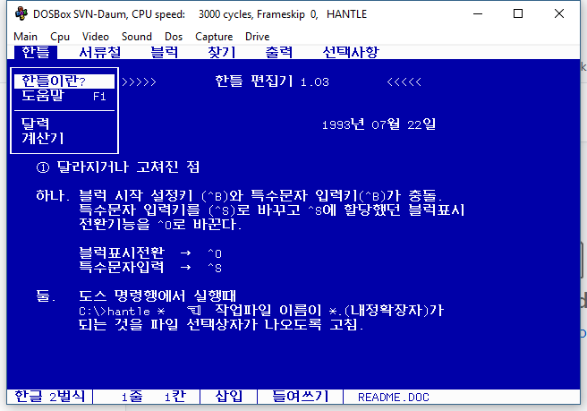

# Hantle - a text editor that supports Hangul. 

DOS version. Built in 1993. 

The character set here is Johab Code (KS C 5601-1992) that provides all 11,172 Hangul characters by composing them with five-bit codes for the 19 leading consonants, 21 vowels, and 28 trailing consonants (19 * 21 * 28 = 11,172)

* Tested in DOSBox 0.74-3* 
* Compile with Turbo C 2.01 (C:\TC2) or Borland C++ 3.0 (C:\TC3)
* Hangul: Halla Pro Library 2.40 (C:\HLIB2) or 3.0 (C:\HLIB3)
  - Missing header files: HINPUT.H, HKEYDEF.H --> C:\HLIB\INCLUDE2 manually
* Project files
  - Turbo C 2.01: HANTLE2.PRJ 
  - Borland C++ 3.0: HANTLE3.PRJ

## Compilers
* [Turbo C 2.01](https://drive.google.com/drive/folders/15jHp-THOiT0wDgwv7lfmTKjfJ_-m9nXl?usp=share_link)
* [Borland C++ 3.0](https://drive.google.com/drive/folders/1MGpVNogr7GzgG62JnZBLpW158J24DsxU?usp=share_link)

## Screenshot

